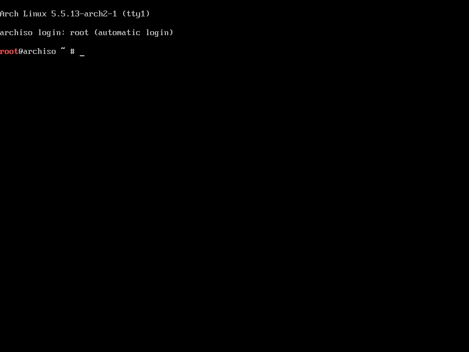
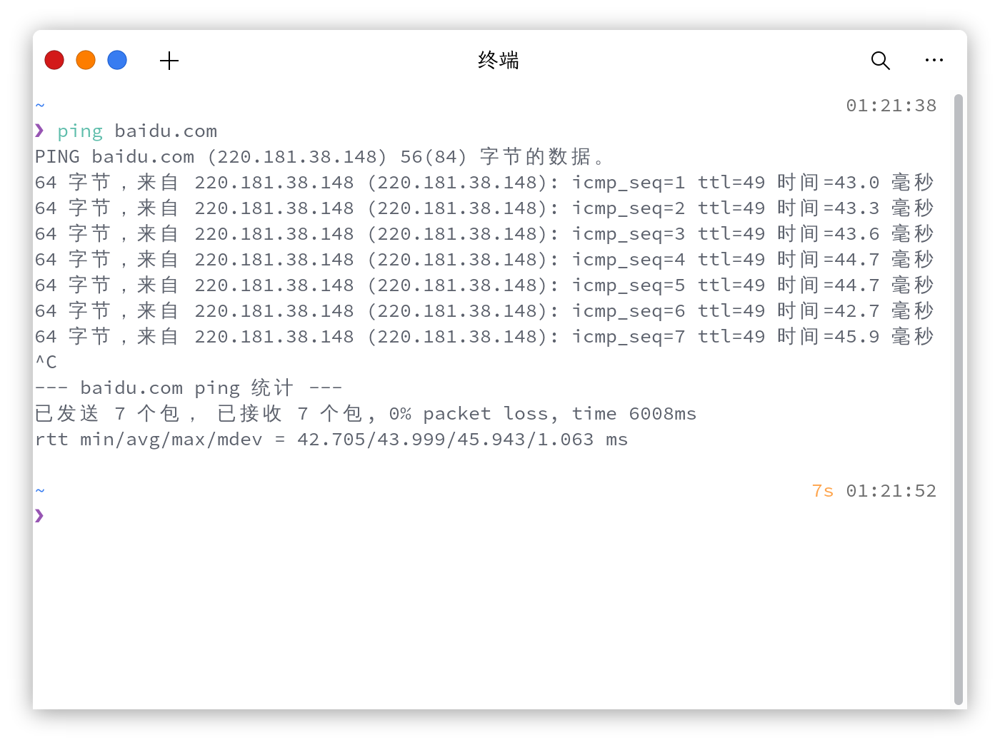
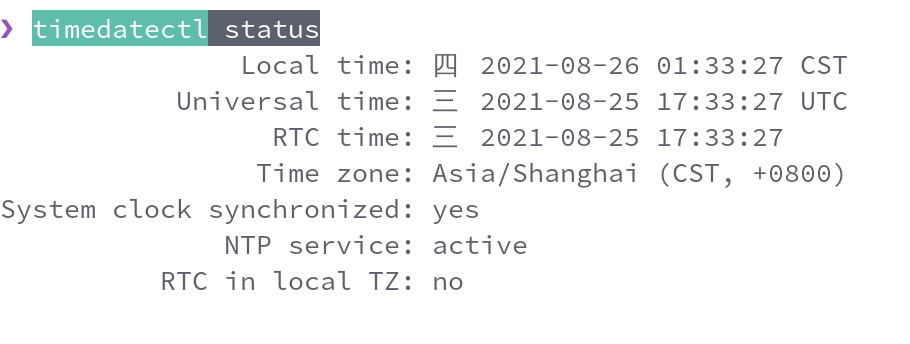
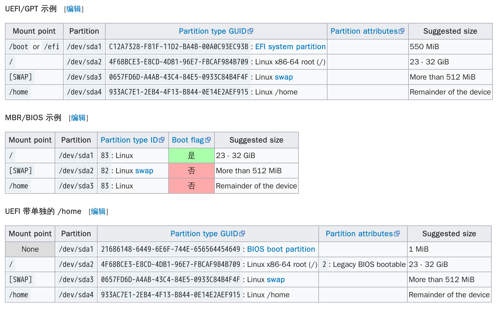
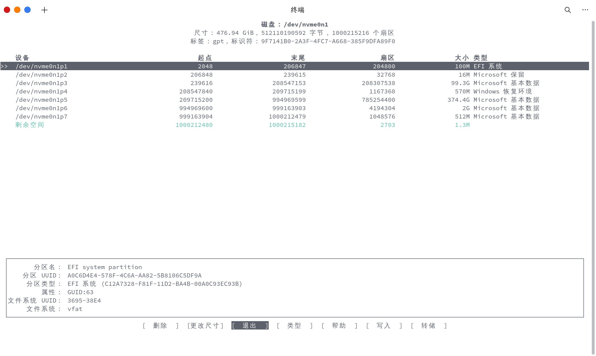
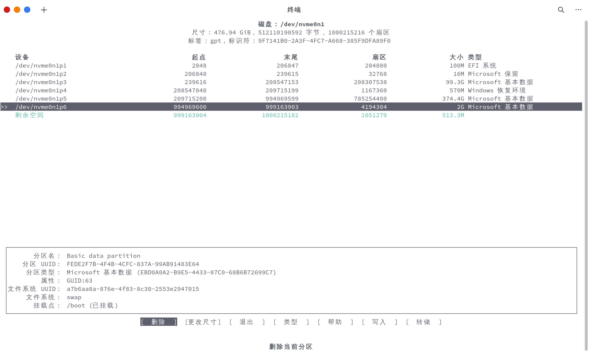
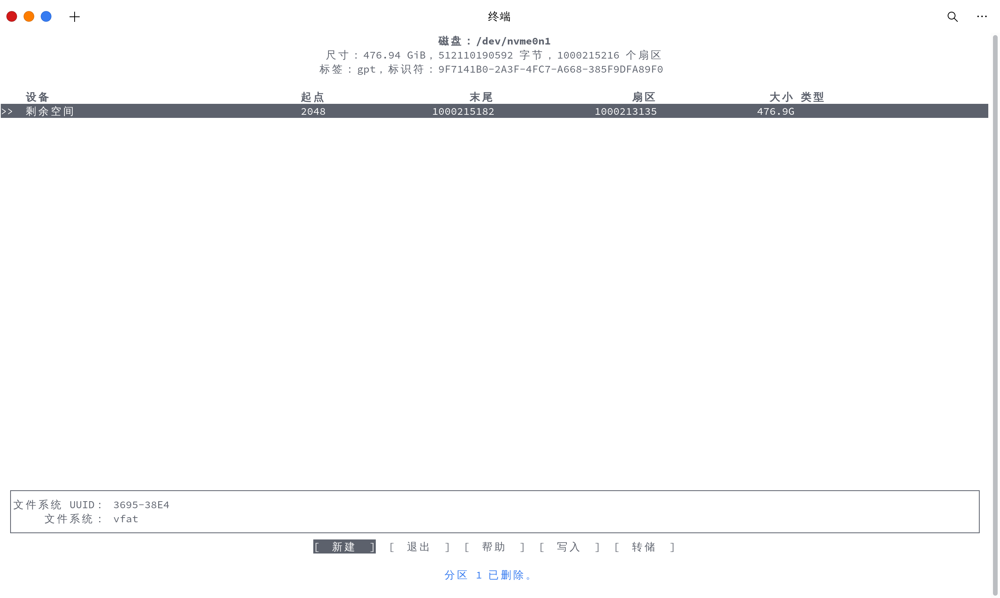
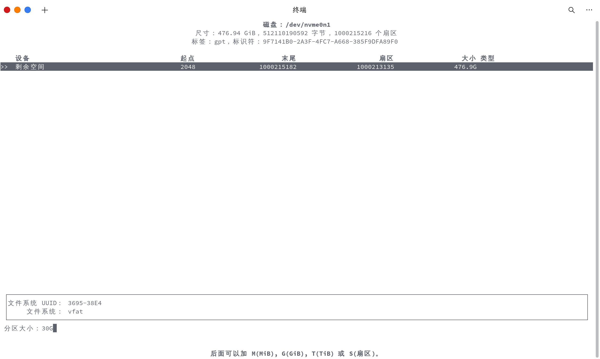
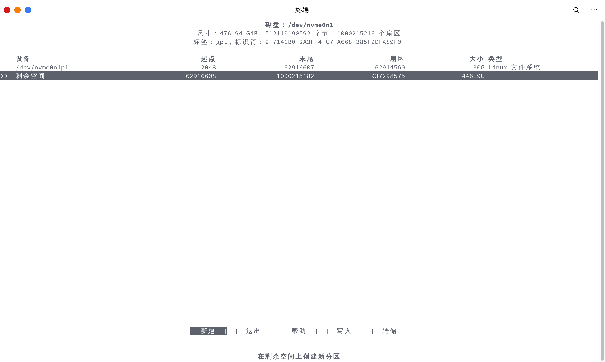

# 基本系统安装

本文将为你介绍如何安装 Arch Linux 基本系统。

如果你还没有制作 Arch Linux 启动盘，请阅读 [准备安装#准备安装介质](/guide/getting-started/#准备安装介质)。

如果你是想安装 Arch Linux + Windows 双系统，请阅读 [多系统安装#Windows](/advanced/Dual-boot/#Windows) 部分。

## 连接网络

成功启动到 archiso 后，你会看到如下界面



::: tip

上图中 root 是用戶名。如果用户名出现数字，则该数字代表上一个命令的 exit status。

正常结束的命令 exit status 是 0，默认不会显示出来。如果出现 1、2、127 这种则是某种东西报错。

:::

### 选择合适的网络连接方式

你可以选择下面适合你的连接方式连接网络。


#### 连接有线网络

如果你能连接有线网络，最好的办法是直接插网线连接网络。

（至于网线怎么插总不用我说了吧...)

#### 连接无线网络

如果你电脑有无线网卡的话（绝大多数电脑应该都有），则可以尝试通过 WiFi 连接。我们可以通过 archiso 内置的 iwd 软件完成这一过程。

::: tip

 2020 年 7 月的 ArchISO 砍掉了 netctl，经典的 wifi-menu 已被 iwctl 取代。如果你在某个教程里还看到了「使用 wifi-menu 连接 WiFi」这样的字样，请提醒作者更新教程……

 ~~所以 wpa_supplicant 使用者竟成最后赢家。~~

:::

在使用 iwctl 之前，我们需要先检查一下你的网卡是否被物理禁用或软件禁用。

物理禁用一般需要你的电脑存在可以物理按键或滑块可以手动关闭或打开网卡（当然，我觉得大多数电脑是没有这玩意的）。

软件禁用则考虑网卡是否被 rfkill 禁用，目前已知 ideapad（联想小新系列）会自动禁用无线网卡和蓝牙。

对于无线网卡被 rfkill 禁用的用户，输入以下命令解除 block
```bash
rfkill unblock all
```

在确认无误后，输入如下命令进入 iwd 的 shell。

```
iwctl
```

输入如下命令列出你电脑的无线网络设备（一般就是你电脑的网卡）

```bash
 device list
```

常见的网卡名称是 `wlan0` 这样的。请根据自己电脑的实际情况判断。

输入如下命令列出所有网络，命令中的 `device` 需要替换为你上一步看到的网卡的名称

```bash
station device get-networks
```

比如，如果你的网卡名称是 `wlan0`，那么你应该输入的命令是

```bash
station wlan0 get-networks
```

如果你的电脑无线网卡工作正常的话，此时屏幕上会列出你熟悉的 WiFi 名称。如果没有任何结果或者出现报错的话，则需要你自己检查是否是网卡出现问题或者你打错了某个字符或者少了空格。

输入如下命令连接 WiFi，就像上面一样，`device` 需要替换成你电脑网卡的名字，`SSID` 需要替换成你想要连接且上面已经列出的 WiFi 名称

```bash
station device connect SSID
```

如果 WiFi 有密码，此时会提示你输入密码，输入 WiFi 密码后回车即可。

完成上述操作后，输入 `exit` 退出 iwd 的 shell。

::: warning

部分 WiFi 名称中可能含有特殊字符，比如中文或者 emoji。终端无法输入这些特殊字符因此无法连接到该 WiFi。

建议更改 WiFi 名称或者更换其他连接方式

:::

#### 借助 Android 网络共享连接

因为国内手机的 Android 系统大多数是由厂商自行修改过的，因此不便统一描述。建议自行搜索所使用系统的操作方法。

简而言之，Android 可以通过以下两种方式共享网络连接：

- USB 网络共享，效果与插网线等同
- 热点共享，操作步骤和效果于连接 WiFi 等同

#### 检查网络连接

为了检测电脑真的是否连接上网络，我们可以输入如下命令检测

```bash
ping www.baidu.com
```

ping 后面的网址可以是任何国内可以直连的网址。

如果已连接上网络，则电脑会疯狂输出一大堆延迟测试数据。反之则只有简单的`Timeout`报错或长时间无输出结果。

下面是成功连接网络的情况




此时按 `Ctrl+C` 以中止输出。

::: tip

`Ctrl+C` 的意思是同时按住 Ctrl 键和 C 键，是 Linux 终端下常用的中止当前进程的方法之一。

`Ctrl+C` 可以近似理解为强行终止当前终端的活动进程（实际上只是发出相应信号，~~程序到底会不会停下来还得看它心情~~)。

比如上面，ping 这个进程正在运行，我们通过 `Ctrl+C` 将它强行终止。

:::

## 设置系统时间

输入如下命令进行 NTP 时间同步。

```bash
timedatectl set-ntp true
```

可以输入如下命令检测当前时间状态。

```bash
timedatectl status
```

输出结果大致如下图所示



如果因为各种原因无法同步时间，也可以输入下面的命令手动同步时间

```
timectl set-time "yyyy-MM-dd hh:mm:ss"
```

其中 y 代表年(year)，M 代表月(month)，d 代表天(day)，h 代表小时(hour)，m 代表分(minute)，s 代表秒(second)。

例如：

```bash
timectl set-time "2021-08-25 22:39:42"
```

## 设置硬盘分区

本节仅介绍一般情况（电脑只有一块硬盘，使用 U 盘启动 archiso）下的分区设置流程。在你完全了解行为后果的前提下，你可以根据你自己的情况修改相应安装步骤。

### 确认当前硬盘信息

你可以先输入如下命令查看当前电脑硬盘分区的状态。

```bash
lsblk
```

示例输入结果如下：

```
NAME   MAJ:MIN RM   SIZE RO TYPE MOUNTPOINT
sda      8:0    0 463.9G  0 disk
├─sda1   8:1    0   512M  0 part
├─sda2   8:2    0    16M  0 part
├─sda3   8:3    0 103.4G  0 part
└─sda4   8:4    0 253.4G  0 part
sdb      8:16   1   7.5G  0 disk
└─sdb1   8:17   1   7.5G  0 part /run/archiso/bootmnt
sr0     11:0    1  1024M  0 rom
loop0    7:0    0 346.1M  1 loop /run/archiso/sfs/airootfs
```

输出结果中的 /dev/sdX 代表的是你电脑的硬盘。

::: tip

 *输出结果不可能真的出现`/dev/sdX`，此处的 X 只是代表如 a、b、c 这样的符号，如数学中用字母代替数的作用*。比如，上图输出中`/dev/sda`是你电脑的硬盘，`/dev/sdb`是你的 U 盘（Arch Linux 启动盘），`/dev/sda1`是你硬盘`/dev/sda`的第一个分区。

 :::

::: tip

如果你电脑硬盘是一块新硬盘或者已经清空的硬盘的话，你大概看不到 `/dev/sda1 `这样的分区。

如果你看到了一些其它的东西，比如`/dev/nvme0n1` 这样的，则代表你的电脑上有一块 NVMe SSD

如果是`/dev/mmcblk0` 这样的，则代表你的电脑上有 eMMC 存储。

此时你的启动盘可能会被归为 `/dev/sda `，所以**下面要根据你自己实际情况操作**。

:::

### 对硬盘进行分区

对于刚接触 Linux 的新手来说，「分区」可能还是比较陌生的概念，我打个比方解释一下。

你可以想象你电脑硬盘是一块大蛋糕，「对硬盘进行分区」就是将这块大蛋糕切成几块小蛋糕，这几块小蛋糕就是「分区」。Windows 下 C 盘、D 盘之类的就是典型的「分区」。

对于「怎么分区」以及「分多大」我先要进行一些说明。

你可能在其他 Arch Linux 安装教程或者其他别的 Linux 发行版安装教程中看到他们关于分区大小的各种理论或规范。实际上，如何分区、分区多大是没有固定标准的。当你对 Linux 足够熟悉并清楚该如何操作，不分区都是可以的（即无分区方案，前提是你知道操作方法并能解决相应后果）。你完全可以通过多种不同的方法完成分区（~~甚至可以通过 Windows 磁盘管理~~），只要最后结果满足下图中示例分区布局即可。



你可能会好奇，为什么上面除了`[SWAP]`以外的分区名字都是以`/`开头。

我们再回忆一下，我们在上文说过，Linux 分区并没有所谓的标准和规范，甚至可以不分区，这里面的原因就是「Linux 分区是**挂载**在某个目录使用的」。

「挂载」这个概念你其实一点都不陌生。你给电脑插上 U 盘，给手机插上 SD 卡，**本质上都是挂载你的 U 盘和 SD 卡到某个目录**。比如 Windows 插上 U 盘，U 盘可能挂载为 E 盘或 F 盘，Android 插上 SD 卡，SD 卡挂载为 `/storage/<SDCard-id>`。再发散一下思维，我们的电脑硬盘又何尝不是**挂载**呢？

现在我们可以解释上面的那个问题了。这些分区的命名代表他们会被挂载到哪个目录，比如`/boot`就代表这个分区将被挂载于 /boot 目录。

我留一道思考题，**从逻辑的角度上**来讲，是「先有分区」还是「先有目录」？这个问题纯粹供你无聊的时候打发一下时间，现在不用去思考这个问题，~~因为我也没去考证这个问题~~。思考一遍这个问题可能会让你对 Linux 分区布局了解更透彻一点。

我简单介绍一下上图各分区的作用。

- `/boot`或者`/efi`是 Linux 用于存储引导信息的分区，UEFI 引导必须创建这个分区（除非你清楚怎么实现无分区引导），BIOS 可以不分这个分区。
- `/`是 Linux 中的根分区，一般所有的分区都挂载于这个分区下。无论是 BIOS 还是 UEFI 都必须创建这个分区。
- `[SWAP]`是 Linux 的交换分区，相当于 Windows 的虚拟内存。`[SWAP]`本身**不需要挂载**，只需要**启用**。你现在肯定明白为什么`[SWAP]`分区不是以`/`开头了。
- `/home`是 Linux 的用户分区，如果你创建这个分区的话，你的用户数据（下载的文件之类的）将会独立于根分区存储。如果把根分区当作 Windows 下的 C 盘的话，那么 `/home`就是 D 盘、E 盘。这只是方便你理解的类比，事实上 Linux 下完全不需要 /home 目录单独分区（我也不知道是哪位最先想出的鬼点子）。独立的`/home`分区的**好处**是用户数据独立存储，无论你怎么对根分区进行修改（重装系统之类的），只要你没有修改`/home`分区，你的用户数据可以安然无恙地保存在你的硬盘上。**缺点**是你很难确定你的`/home`到底该多大。如果过小的话，可能会出现`/home`分区满了没地方存数据，`/`分区还空了一大片；如果过大的话，可能出现`/`分区满了没地方装软件，`/home`分区空荡荡的。

#### 我该如何选择我的分区方案？

就像我上面所说的，分区并没有所谓的「标准」和「规范」。你当然可以打开某些视频教程对着敲轻松完成硬盘分区，但是我鼓励你思考一下自己的分区思路，因为这个不仅非常的简单，而且还有助于你理解 Linux 系统的组成。

这里给出几个问题帮助你完成这一过程。

1. 你使用的是 UEFI 引导还是传统 BIOS，如果你使用的是 UEFI 引导，你是否需要`/boot`分区？
2. 你电脑内存大小是小于 2G 还是大于 8G，你该如何选择你的 `[SWAP]`分区大小？
3. 你是否真的需要`/home`独立分区？

这里介绍一个比较常规的分区方法和说明，同时也建议按照如下顺序进行分区。

- `/boot`分区，存储引导信息（还可以存储内核），大小建议为 512MB
- `[SWAP]`分区，交换分区。对于内存小于或等于 2G 的电脑可以设为内存大小的两倍，对于内存大于 8G 的电脑可以只分 2G。你也可以使用交换文件代替交换分区，这里不进行介绍。
- `/`分区，即根目录，用来存储系统和将来安装的软件等数据。如果你创建单独的 `/home` 分区，则建议该分区大小不小于 20G，最好大于`32G`，根据你的需求和剩余空间大小而定；如果不创建单独的 `/home` 分区，请把磁盘所有剩余空间留给 `/`分区。
- `/home`分区（可选），即用户分区，用于存储用户的数据。该分区是用户自己数据存储的地方。如果你不单独分出 `home` 分区，则你的所有数据将仅存储在 `/mnt `分区。

上面说了，分区方法有很多种，这里介绍 `cfdisk`（模拟图形化界面）和`fdisk`（对话框式）这两种工具的分区方法。你只要选择你喜欢的一种即可。

#### 使用 cfdisk 进行分区

在终端输入如下命令进行分区：

```bash
cfdisk /dev/sdX
```

::: warning

最后一次提醒，`/dev/sdX` 只是示例，具体命令需要根据你实际情况进行更改，比如 `cfdisk /dev/nvme0n1` 这样的，不要抄作业把名字也抄上了

:::

此时屏幕应该显示你电脑相应的系统硬盘的信息。
同时，屏幕底部会显示几个［xxx］，其中有

```
[ Delete ] [Resize] [ New ] [ Quit ] [Type] [ Help ] [ Write ] [ Dump ]
```

这几个［xxx］的意思分别是

```
[删除] [更改尺寸] [新建] [退出] [类型] [帮助] [写入] [转储]
```

底部的选项的位置可能会随着 cfdisk 的更新发生变化，但是相应选项的功能不会改变。

在硬盘信息处，可能出现一个绿色的`Free space`，这个代表空白分区/未分配分区，中文可翻译为「剩余空间」。

你可以通过键盘上下方向键移动光标至自己想要的分区，使用左右键更改操作选项。

下图是我的 cfdisk，中文可以作为你的英文界面对应的翻译



啊？你问我为什么我这是中文？你照着教程装完你也有了！

事实上尝试英文界面对 Linux 使用是极其有帮助的，因为 Linux 终端一般无法显示特殊字符（比如中文）。

可以看到，我图中并没有 [新建] 这个选项，这是因为我磁盘中并没有 Free Space (剩余空间)。

如果我们需要创建一个 Free Space，我们可以使用键盘左右方向键选择「Delete」（删除），然后使用上下方向键选择你想要删除的分区，然后回车删除。这时你的界面会出现绿色的 Free Space，就像这样下面这样



如果你想全盘安装 Arch Linux （电脑上只安装 Arch Linux 一个操作系统），直接删除所有的分区即可，就像下面这样



下面我们开始新建分区。

新建分区的操作和删除分区差不多，唯一的区别可能是需要手动输入分区大小。

例如，如果需要新建一个 30G 大小的分区，你应该将光标通过键盘上下方向键移至`Free space`，再通过键盘左右方向键选择`[New]`，回车后输入`30G`，然后回车确认

下面是一个示例





::: tip

如果电脑引导类型是传统 BIOS，选择`[ New ]`回车后有可能需要你选择建立`主分区`还是`扩展分区`。(该情形会在硬盘中没有分区或者主分区不足4个时询问。如果硬盘已经有4个主分区则不会询问，默认建立扩展分区。)

EFI启动可以建立无限个主分区，所以不会询问，直接建立主分区。

给传统 BIOS 引导的建议：

原则上尽量使用主分区。如果主分区用尽，建立扩展分区时注意**不要修改分区大小**，直接回车。因为扩展分区本身不是一个分区。
回车后会发现扩展分区下的硬盘还是剩余空间，只是被划分到扩展分区下了。

:::

Q：我建立分区的时候手抖不小心把分区大小输错了，新建立的分区大小不是我想要的，我该怎么办？

A：你可以按照上面教你的分区操作方法，像上面删除分区一样把这个分区删了再新建即可。

创建好你的分区之后，选择`[ Write ]`（写入）再选择`[ Quit ]`（退出）。退出时你需要输入`yes`确认。*输入完整的`yes`不是输入一个`y`*。`[ Write ]`的作用是把你上面修改好的分区表写入磁盘，相当于「保存」。

#### 使用 fdisk 进行分区

