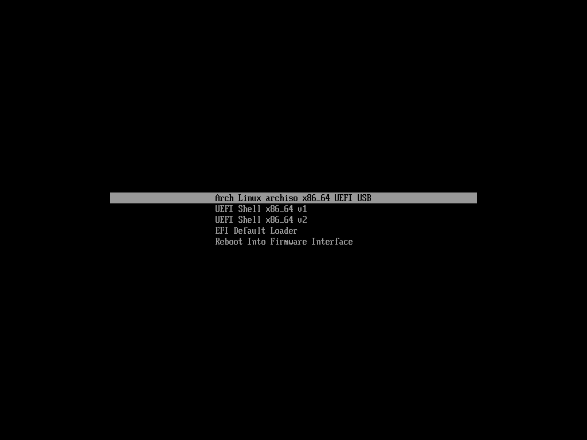

# 安装前的准备

本文将为你介绍 Arch Linux 安装前的准备事项。

如果你是 GNU/Linux 新手，建议你先阅读一遍 [FAQ](/#faq)。

如果你是想安装 Arch Linux + Windows 双系统，请阅读 [多系统启动#Windows](/advanced/Dual-boot/#Windows) 部分。


## 确定电脑的启动类型
::: tip

电脑启动类型可以粗略地分为「传统 BIOS」（简称 BIOS）和「UEFI」。因为两者在启动盘制作上和安装步骤上存在差异，所以必须在安装前对电脑的启动类型进行确认。如果是最近十年生产的设备，使用的一般是 UEFI 引导。

如果系统未以你想要的模式引导启动，请参考你的主板说明书。

:::

### Windows 确定方法

首先启动进入 Windows 桌面，同时按下 Win+R 打开运行对话框，然后输入 `msinfo32` 后回车确认打开系统信息。


查看「BIOS 模式」是不是 UEFI。如果是，则为 UEFI 引导，反之则为传统 BIOS 引导。


### Linux 确定方法

Linux 输入如下命令

```bash
ls /sys/firmware/efi/efivars
```

如果命令结果显示了目录且没有报告错误，则系统以 UEFI 模式引导。 如果目录不存在，则系统可能以 [BIOS](https://en.wikipedia.org/wiki/BIOS) 模式 (或 [CSM](https://en.wikipedia.org/wiki/Compatibility_Support_Module) 模式) 引导。

## 准备安装介质

### 下载 Arch Linux ISO

你可以通过以下网站中的任意一个获取 Arch Linux ISO 文件（下文简称 archiso）

- [清华大学开源软件镜像站](http://mirrors.tuna.tsinghua.edu.cn/archlinux/iso/)
- [中国科技大学开源软件镜像站](http://mirrors.ustc.edu.cn/archlinux/iso/)
- [北京外国语大学开源软件镜像站](http://mirrors.bfsu.edu.cn/archlinux/iso/)
- [网易开源镜像站](http://mirrors.163.com/archlinux/iso/)

这里使用「清华大学开源软件镜像站」作为示范：


上图中 `2021.08.01/` 这样的是 archiso 发行时间（同时也是发行版本）。

我们点击 `latest` 下载最新版本。

::: tip

由于 Arch Linux 是滚动发行版，旧的 archiso 可能会在安装上存在一些兼容性问题，所以无论是使用 archiso 安装系统还是修复系统，都建议使用最新版本避免异常。

:::

点击文件扩展名（后缀）为`iso` 的文件下载即可。


### 制作 Arch Linux 启动盘

::: tip

启动盘的制作一般需要一个可用的 USB 存储介质，如 U 盘、SD 卡 + 读卡器。如果你使用的 Android 手机且已获取 ROOT 权限，你也可以使用某些第三方工具制作 Arch Linux 启动盘。

:::

#### Windows 系统操作方法

Windows 建议使用 [Rufus](http://rufus.akeo.ie/downloads/) 烧录镜像。

::: tip

Rufus 是一个可以帮助格式化和创建可引导 USB 闪存盘的工具，比如 USB 随身碟，记忆棒等等。麻雀虽小，五脏俱全，体积虽小，功能全面。

:::

::: warning

注意，某些 Linux 可用的软碟通(UItraISO)**不适用于** Arch Linux

:::

1. 下载完成后，双击打开该文件，允许或不允许 Rufus 联网检查程序更新皆可。

   

2. 插入你的 U 盘，在「设备」选项框中选择你的 U 盘（一般会默认选中，以下图片均为示例）。

   

3. 在「引导类型选择」下选择 「镜像文件（请选择）」，然后单击右侧的「选择」来选择你下载好的镜像。

   

4. 「持久分区大小」默认即可。对于「分区类型」，UEFI 引导选择「GPT」，BIOS 引导保持「MBR」即可

   

5. 「格式化选项」保持默认即可，单击开始来进行下一步。

   

6. 选择 「以 ISO 镜像 模式写入（推荐）」，单击「OK」进行下一步。

   

7. 单击开始来烧录镜像。

   

8. 等待烧录完成即可。（下图即为烧录完成的一个示例）

   

#### Linux 操作方法

推荐使用 Linux 下经典的 dd  命令完成启动盘制作。

首先输入如下命令确定获取电脑硬盘信息，所获取的信息中应该包含 U 盘标识，一般是 `/dev/sdX` 这种格式

```bash
sudo fdisk -l
```

输入如下命令制作启动盘

```bash
 dd if=<ISO镜像位置> of=/dev/sdX bs=4M
```
耐心等待制作完成即可

## 启动到 Live 环境

### 禁用安全启动（Secure Boot）

Arch Linux 单系统安装可以不禁用 Windows 的快速启动但一定要禁用安全启动。

该部分建议自行在网上寻找相关教程。因为不同电脑可能存在不同的设置方式和 BIOS 界面，不便统一概述，因此最好的办法是在网上找到自己机型对应的教程。

这里给出常见的电脑厂商的进入 BIOS 快捷键（~~开机的时候狂敲就对了~~）

| 电脑厂商        | 快捷键 |
| ------------- | -----:|
| 联想（含拯救者、ThinkPad） | F2 或 F12 |
| 华为    | Fn + F2 |
| 华硕 | ESC |
| 惠普 | F9 (-F10) |
| 戴尔 | F12 |
| 三星 | F12 |
| 小米 | F2 |
| 神舟 | F2 |
| 雷神 | F2 或 F12 |
| 外星人 | F2 |

### 从启动盘启动

首先插上你的 Arch Linux 启动盘，并进入 BIOS。

然后在 BIOS 的`Boot Menu`（可能是别的名字）中修改你的启动盘为第一项。

部分支持 UEFI 的电脑可能在 BIOS 中禁用了 UEFI。你可以在 BIOS 的 Boot Mode 中修改 `Legacy/CSM` 为` UEFI only`。

如果一切顺利，你开机就可以看到 Arch Linux 启动界面了！

传统 BIOS 启动界面大致是这样：


UEFI 启动界面大致是这样：



此时回车选择第一项即可启动到 archiso。

你已经向 Arch Linux 迈开了自己坚实的第一步！

***


部分图片来源于：

 - [《给 GNU/Linux 萌新的 Arch Linux 安装指南 rev.B》](https://blog.yoitsu.moe/arch-linux/installing_arch_linux_for_complete_newbies.html)
